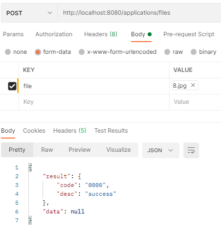
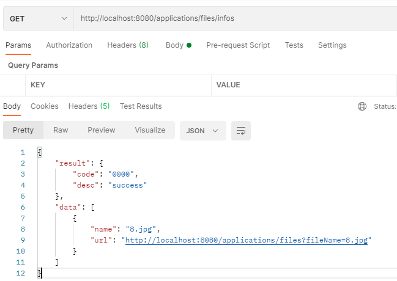
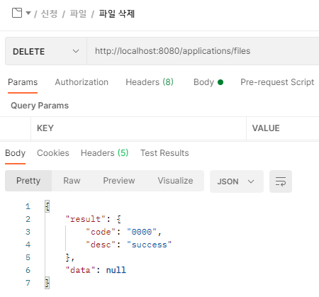
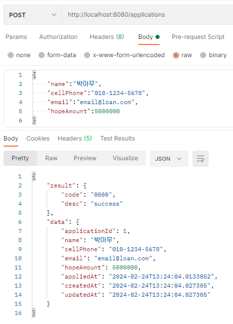
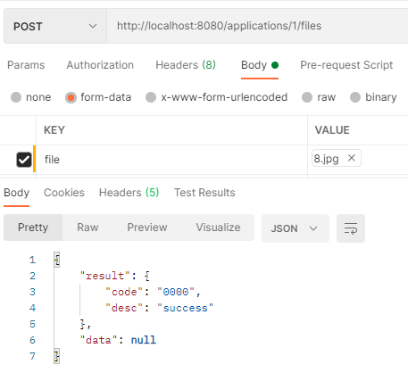
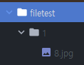
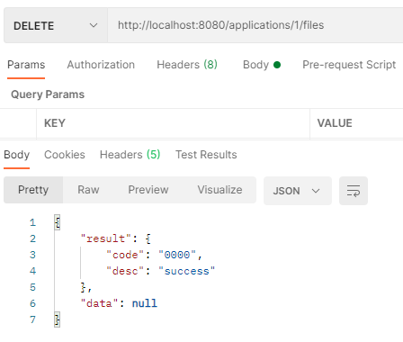

## Ch02. 대출 상담 기능 개발
### 02. 대출 상담 도메인 테이블 정의
코드 실행하면 아래 쿼리가 적용되어 테이블이 생성된다.

    create table counsel (
        counsel_id bigint generated by default as identity,
        created_at datetime default CURRENT_TIMESTAMP NOT NULL COMMENT '생성일자',
        is_deleted bit default false NOT NULL COMMENT '이용가능여부',
        updated_at datetime default CURRENT_TIMESTAMP ON UPDATE CURRENT_TIMESTAMP NOT NULL COMMENT '수정일자',
        address varchar(50) DEFAULT NULL COMMENT '주소',
        address_detail varchar(50) DEFAULT NULL COMMENT '주소 상세',
        applied_at datetime DEFAULT NULL COMMENT '신청일자',
        cell_phone varchar(13) DEFAULT NULL COMMENT '전화번호',
        email varchar(50) DEFAULT NULL COMMENT '책임자 이메일',
        memo text DEFAULT NULL COMMENT '상담 메모',
        name varchar(12) DEFAULT NULL COMMENT '상담 요청자',
        zip_code varchar(5) DEFAULT NULL COMMENT '우편번호',
        primary key (counsel_id)
    )

 

### 03. 대출 상담 등록 기능 구현
> postman  

    <요청>
    [POST] http://localhost:8080/counsels  
    [json]
    {
        "name":"박아무",
        "cellPhone":"010-1234-5678",
        "email":"email@loan.com",
        "memo":"대출 상담을 원함",
        "address":"서울 아무곳",
        "addressDetail":"123-45",
        "zipCode":"11122"
    }

    <응답>
    {
        "result": {
            "code": "0000",
            "desc": "success"
        },
        "data": {
            "counselId": 1,
            "name": "박아무",
            "cellPhone": "010-1234-5678",
            "email": "email@loan.com",
            "memo": "대출 상담을 원함",
            "address": "서울 아무곳",
            "addressDetail": "123-45",
            "zipCode": "11122",
            "appliedAt": "2024-02-23T09:12:50.2105476",
            "createdAt": "2024-02-23T09:12:50.2355479",
            "updatedAt": "2024-02-23T09:12:50.2355479"
        }
    }

 

### 04.대출 상담 조회 기능 구현
> postman

    <요청>
    [GET] http://localhost:8080/counsels/1

    <응답>
    {
        "result": {
            "code": "0000",
            "desc": "success"
        },
        "data": {
            "counselId": 1,
            "name": "박아무",
            "cellPhone": "010-1234-5678",
            "email": "email@loan.com",
            "memo": "대출 상담을 원함",
            "address": "서울 아무곳",
            "addressDetail": "123-45",
            "zipCode": "11122",
            "appliedAt": "2024-02-23T09:12:50.210548",
            "createdAt": "2024-02-23T09:12:50.235548",
            "updatedAt": "2024-02-23T09:12:50.235548"
        }
    }

    <요청>
    [GET] http://localhost:8080/counsels/2

    <응답>
    {
        "result": {
            "code": "9000",
            "desc": "system error"
        },
        "data": null
    }

 

### 05.대출 상담 수정 기능 구현
> postman

    <요청>
    [PUT] http://localhost:8080/counsels/1
    [json]
    {
        "name":"김아무",
        "cellPhone":"010-5678-1234",
        "email":"email@loan.com",
        "memo":"대출 상담을 원함",
        "address":"수원 아무곳",
        "addressDetail":"123-45",
        "zipCode":"22211"
    }

    <응답>
    {
        "result": {
            "code": "0000",
            "desc": "success"
        },
        "data": {
            "counselId": 1,
            "name": "김아무",
            "cellPhone": "010-5678-1234",
            "email": "email@loan.com",
            "memo": "대출 상담을 원함",
            "address": "수원 아무곳",
            "addressDetail": "123-45",
            "zipCode": "22211",
            "appliedAt": "2024-02-23T09:42:47.275373",
            "createdAt": "2024-02-23T09:42:47.299372",
            "updatedAt": "2024-02-23T09:43:11.5815086"
        }
    }

 

### 06.대출 상담 삭제 기능 구현
> postman

    <요청>
    [DELETE] http://localhost:8080/counsels/1
    
    <응답>
    {
        "result": {
            "code": "0000",
            "desc": "success"
        },
        "data": null
    }

 

## Ch03. 대출 신청 기능 개발
### 02. 대출 신청 도메인 테이블 정의
    create table application (
        application_id bigint generated by default as identity,
        created_at datetime default CURRENT_TIMESTAMP NOT NULL COMMENT '생성일자',
        is_deleted bit default false NOT NULL COMMENT '이용가능여부',
        updated_at datetime default CURRENT_TIMESTAMP ON UPDATE CURRENT_TIMESTAMP NOT NULL COMMENT '수정일자',
        applied_at datetime DEFAULT NULL COMMENT '신청일자',
        cell_phone varchar(13) DEFAULT NULL COMMENT '전화번호',
        email varchar(50) DEFAULT NULL COMMENT '신청자 이메일',
        fee decimal(5,4) DEFAULT NULL COMMENT '취급수수료',
        hope_amount decimal(15,2) DEFAULT NULL COMMENT '대출 신청 금액',
        interest_rate decimal(5,4) DEFAULT NULL COMMENT '금리',
        maturity datetime DEFAULT NULL COMMENT '만기',
        name varchar(12) DEFAULT NULL COMMENT '신청자',
        primary key (application_id)
    )

 

### 03. 대출 신청 등록 기능 구현
> postman

    <요청>
    [POST] http://localhost:8080/applications
    [json]
    {
        "name":"박아무",
        "cellPhone":"010-1234-5678",
        "email":"email@loan.com",
        "hopeAmount":5000000
    }

    <응답>
    {
        "result": {
            "code": "0000",
            "desc": "success"
        },
        "data": {
            "applicationId": 1,
            "name": "박아무",
            "cellPhone": "010-1234-5678",
            "email": "email@loan.com",
            "hopeAmount": 5000000,
            "appliedAt": "2024-02-23T12:19:19.5854754",
            "createdAt": "2024-02-23T12:19:19.6104735",
            "updatedAt": "2024-02-23T12:19:19.6104735"
        }
    }

 

## Ch04. 대출 신청 조회 기능 구현
> postman

    <요청>
    [GET] http://localhost:8080/applications/1

    <응답>
    {
        "result": {
            "code": "0000",
            "desc": "success"
        },
        "data": {
            "applicationId": 1,
            "name": "박아무",
            "cellPhone": "010-1234-5678",
            "email": "email@loan.com",
            "hopeAmount": 5000000.00,
            "appliedAt": "2024-02-23T13:18:44.010503",
            "createdAt": "2024-02-23T13:18:44.024505",
            "updatedAt": "2024-02-23T13:18:44.024505"
        }
    }

    <요청>
    [GET] http://localhost:8080/applications/2

    <응답>
    {
        "result": {
            "code": "9000",
            "desc": "system error"
        },
        "data": null
    }

 

### 05.대출 상담 수정 기능 구현
> postman

    <요청>
    [PUT] http://localhost:8080/applications/1
    [json]
    {
        "name":"김아무",
        "cellPhone":"010-5678-1234",
        "email":"email@loan.com",
        "hopeAmount":"50"
    }

    <응답>
    {
        "result": {
            "code": "0000",
            "desc": "success"
        },
        "data": {
            "applicationId": 1,
            "name": "김아무",
            "cellPhone": "010-5678-1234",
            "email": "email@loan.com",
            "hopeAmount": 50,
            "appliedAt": "2024-02-23T13:31:07.669799",
            "createdAt": "2024-02-23T13:31:07.693796",
            "updatedAt": "2024-02-23T13:31:20.4315625"
        }
    }

 

### 06.대출 신청 삭제 기능 구현
> postman

    <요청>
    [DELETE] http://localhost:8080/applications/1
    
    <응답>
    {
        "result": {
            "code": "0000",
            "desc": "success"
        },
        "data": null
    }

 

### 07. 이용 약관 등록 기능 구현
    create table terms (
       terms_id bigint generated by default as identity,
        created_at datetime default CURRENT_TIMESTAMP NOT NULL COMMENT '생성일자',
        is_deleted bit default false NOT NULL COMMENT '이용가능여부',
        updated_at datetime default CURRENT_TIMESTAMP ON UPDATE CURRENT_TIMESTAMP NOT NULL COMMENT '수정일자',
        name varchar(255) NOT NULL COMMENT '약관',
        terms_detail_url varchar(255) NOT NULL COMMENT '약관상세 URL',
        primary key (terms_id)
    )

 

> postman

    <요청>
    [POST] http://localhost:8080/terms
    [json]
    {
        "name":"신청 이용 약관",
        "termsDetailUrl":"https://abc-storage.acc/dslfjdlsfjlsd"
    }

    <응답>
    {
        "result": {
            "code": "0000",
            "desc": "success"
        },
        "data": {
            "termsId": 3,
            "name": "신청 이용 약관",
            "termsDetailUrl": "https://abc-storage.acc/dslfjdlsfjlsd",
            "createdAt": "2024-02-23T15:22:11.5995144",
            "updatedAt": "2024-02-23T15:22:11.5995144"
        }
    }

 

## 08. 이용 약관 조회 기능 구현
> postman

    <아래와 같이 이용 약관 등록 요청을 내용이 다르게 두 번 보낸다.>
    [POST] http://localhost:8080/terms
    [json]
    {
        "name":"신청 이용 약관",
        "termsDetailUrl":"https://abc-storage.acc/dslfjdlsfjlsd"
    }

    [POST] http://localhost:8080/terms
    [json]
    {
        "name":"신청 이용 약관2",
        "termsDetailUrl":"https://abc-storage.acc/dslfjdlsfjlsd"
    }

    <요청>
    [GET] http://localhost:8080/terms

    <응답>
    {
        "result": {
            "code": "0000",
            "desc": "success"
        },
        "data": [
            {
                "termsId": 1,
                "name": "신청 이용 약관",
                "termsDetailUrl": "https://abc-storage.acc/dslfjdlsfjlsd",
                "createdAt": "2024-02-23T15:27:53.395195",
                "updatedAt": "2024-02-23T15:27:53.395195"
            },
            {
                "termsId": 2,
                "name": "신청 이용 약관2",
                "termsDetailUrl": "https://abc-storage.acc/dslfjdlsfjlsd",
                "createdAt": "2024-02-23T15:27:56.765235",
                "updatedAt": "2024-02-23T15:27:56.765235"
            }
        ]
    }

 

## 09. 대출 신청 이용 약관 등록 기능 구현
고객이 대출 신청 약관을 동의한 정보를 기록하기 위한 기능 추가

    > 약관 2개 등록
    [POST] http://localhost:8080/terms

    <요청 1>
    {
        "name":"신청 이용 약관1",
        "termsDetailUrl":"https://abc-storage.acc/dslfjdlsfjlsd"
    }

    <응답 1>
    {
        "result": {
            "code": "0000",
            "desc": "success"
        },
        "data": {
            "termsId": 1,
            "name": "신청 이용 약관1",
            "termsDetailUrl": "https://abc-storage.acc/dslfjdlsfjlsd",
            "createdAt": "2024-02-23T17:30:51.3996297",
            "updatedAt": "2024-02-23T17:30:51.3996297"
        }
    }
    
    <요청 2>
    {
        "name":"신청 이용 약관2",
        "termsDetailUrl":"https://abc-storage.acc/dslfjdlsfjlsd"
    }

    <응답 2>
    {
        "result": {
            "code": "0000",
            "desc": "success"
        },
        "data": {
            "termsId": 2,
            "name": "신청 이용 약관2",
            "termsDetailUrl": "https://abc-storage.acc/dslfjdlsfjlsd",
            "createdAt": "2024-02-23T17:31:45.1710841",
            "updatedAt": "2024-02-23T17:31:45.1710841"
        }
    }

    
    > 신청 1개 등록
    [POST] http://localhost:8080/application

    <요청>
    {
        "name":"박아무",
        "cellPhone":"010-1234-5678",
        "email":"email@loan.com",
        "hopeAmount":5000000
    }

    <응답>
    {
        "result": {
            "code": "0000",
            "desc": "success"
        },
        "data": {
            "applicationId": 1,
            "name": "박아무",
            "cellPhone": "010-1234-5678",
            "email": "email@loan.com",
            "hopeAmount": 5000000,
            "appliedAt": "2024-02-23T17:32:34.9390498",
            "createdAt": "2024-02-23T17:32:34.9430494",
            "updatedAt": "2024-02-23T17:32:34.9430494"
        }
    }
    
    > 신청 약관 등록
    [POST] http://localhost:8080/1/terms

    <정상 요청>
    {
        "acceptTermsIds":[1, 2] // 약관에 동의한 수(약관 id를 넣으면 된다.)
    }

    <정상 응답>
    {
        "result": {
            "code": "0000",
            "desc": "success"
        },
        "data": true
    }
    
    <실패 요청>
    {
        "acceptTermsIds":[1, 3]
    }
    <실패 응답>
    {
        "result": {
            "code": "9000",
            "desc": "system error"
        },
        "data": null
    }
        
    <실패 요청>
    {
        "acceptTermsIds":[1]
    }
    <실패 응답>
    {
        "result": {
            "code": "9000",
            "desc": "system error"
        },
        "data": null
    }

 

### 10.대출 신청 서류 등록 기능 구현
>filetest 디렉토리를 생성 후 테스트

> postman

 

### 11.대출 신청 서류 조회 기능 구현
> postman

 

### 12.대출 신청 서류 삭제 기능 구현
> filetest 디렉토리도 삭제된다.
> postman

 

### 13. 대출 신청 신청 서류 매핑 기능 구현
- 대출 신청 등록  

 
  
- 파일 업로드  

 

- 파일 삭제

